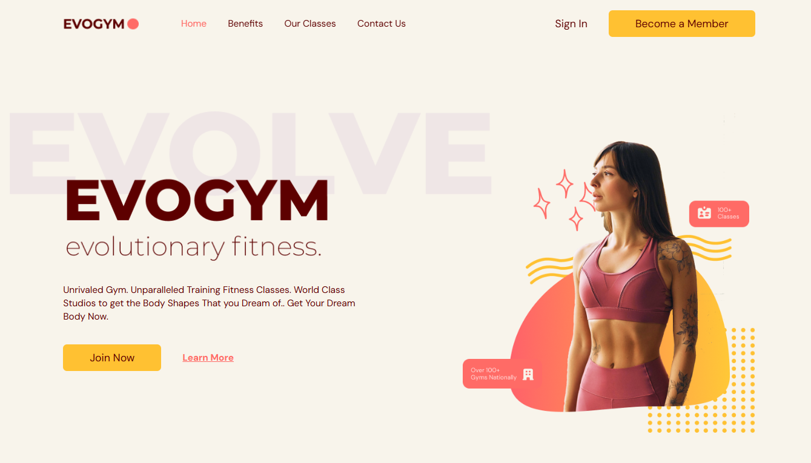

# 🏋️ Gym Landing Page

A modern, responsive landing page for a fitness/gym brand built with **Vite**, **TypeScript**, and **Tailwind CSS**.

## 🚀 Tech Stack

- [Vite](https://vitejs.dev/)
- [TypeScript](https://www.typescriptlang.org/)
- [Tailwind CSS](https://tailwindcss.com/)
- [React](https://reactjs.org/)

## 📸 Screenshot



## 📦 Installation

```bash
# Install dependencies
npm install

# Start development server
npm run dev
```

## 📁 Folder Structure

├── public/
├── src/
│   ├── assets/
│   ├── hooks/
│   ├── scenes/
│   ├── shared/
│   ├── App.tsx
│   ├── main.tsx
│   └── index.css
├── index.html
├── tailwind.config.cjs
├── package.json
└── README.md

## 💻 Author

**Maria Camila Barona**
